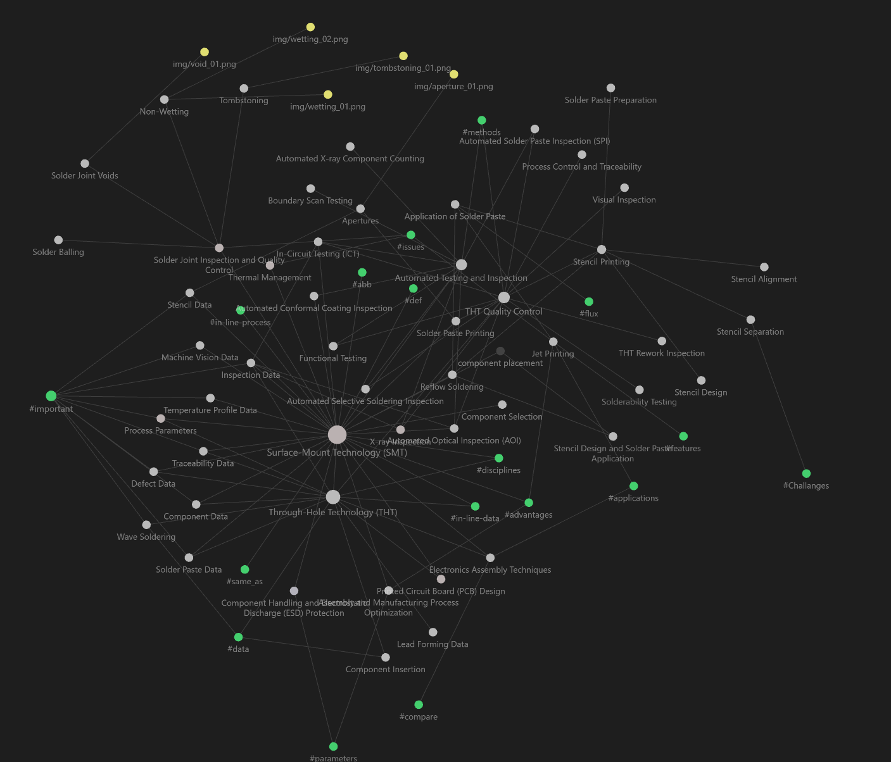

# siemens-use-case
Training a model to forcast future material requirements.

## Dependencies
python = 3.10.8

```
python -m venv ./envs
source envs/bin/activate
pip install -r requirements.txt
```

## Repo info
- Data exploration and model investigations: [`notebookes`](./notebooks)
- Trained models: [`model`](./model)
- Raw, cleaned and splited input data: [`data`](data)
- Documentation: [`Doc`](./doc)
  - Presentation: [`Pdf`](./doc/Case%20Study%20Data%20Scientist%20Production%20Planning.pdf), [`powerpoint`](./doc/Case%20Study%20Data%20Scientist%20Production%20Planning.pdf)
  - Factory-tour : Personal knowledge graph, [`PKG`](./doc/README.md)




## [App Demo](https://siemens-use-case-1.streamlit.app/)
You can run it locally via 
```
streamlit run streamlit_app.py
```

deployed version is also available under, [link](https://siemens-use-case-1.streamlit.app/)
